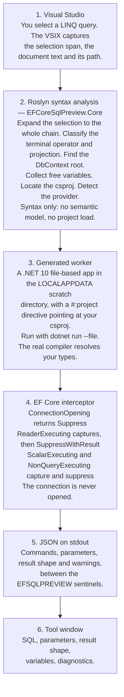

# EF Core SQL Preview

**Select a LINQ query in the Visual Studio editor and see the SQL EF Core will generate for it — without running your app and without a database.**

[](https://github.com/kerols1234/EFCoreSqlPreview/actions/workflows/ci.yml)
[](LICENSE)
[](https://visualstudio.microsoft.com/)
[](https://dotnet.microsoft.com/download)
[](https://learn.microsoft.com/ef/core/)

---

## Why

Checking what SQL a LINQ query produces normally costs a round trip through your whole application: start the
host, authenticate, hit the endpoint, read a log. If the query lives behind a code path you cannot easily
reach, or the database is not on this machine, the loop gets worse.

`ToQueryString()` helps, but it means editing the query, rebuilding, and running something. It also cannot tell
you what the *terminal operator* does — `CountAsync()` and `ToListAsync()` produce very different SQL from the
same chain, and `ToQueryString()` sees neither.

EF Core SQL Preview takes the query as written — custom extension methods, captured variables, terminal
operator, DTO projection and all — compiles it against your real project, and runs it against a real
`DbContext` whose connection is intercepted and never opened. You get the exact command text, the exact
parameter values, and the exact result shape, in about **two to three seconds**, from a right-click.

No database is contacted. Your application is never started.

---

## See it in action

Every SQL block, parameter table and result line below is **verbatim output from the end-to-end test suite**
(`dotnet test --filter "Category=EndToEnd"`), captured against `samples/SampleShop` running EF Core 10.0.10
with no database reachable.

### A DTO projection with a captured variable

Select this in the editor:

```csharp
decimal minPrice = 100m;

return await this.db.Products
    .Where(p => p.Price > minPrice)
    .Select(p => new ProductDto
    {
        Id = p.Id,
        Name = p.Name,
        Price = p.Price,
        CategoryName = p.Category!.Name,
    })
    .ToListAsync();
```

The tool window shows:

```sql
SELECT [p].[Id], [p].[Name], [p].[Price], [c].[Name] AS [CategoryName]
FROM [Products] AS [p]
INNER JOIN [Categories] AS [c] ON [p].[CategoryId] = [c].[Id]
WHERE [p].[Price] > @minPrice
```

| Parameter   | DB type | CLR type | Value |
| ----------- | ------- | -------- | ----- |
| `@minPrice` | Decimal | decimal  | 100   |

> `Result: await ….ToListAsync() -> List<ProductDto> (DTO projection, async)`
>
> Provider `SqlServer` · context `SampleShop.ShopDbContext` · activation `DesignTimeFactory` · 3.0 s

Note what happened without you doing anything: the `Category` navigation became an `INNER JOIN`, `minPrice`
became a real parameter carrying its real value, and the projection collapsed the `SELECT` list to the four
columns the DTO actually needs.

Type `250.75m` into the **Variables** panel and press **Re-run**, and the same query comes back with
`@minPrice = 250.75`.

### Custom `IQueryable` extension methods

This is the case a text-based tool cannot do, because the SQL depends on code in *another file*:

```csharp
string term = "widget";
decimal floor = 10m;

return this.db.Products
    .ActiveOnly()
    .Search(term)
    .PricedAbove(floor)
    .ToDto()
    .ToListAsync();
```

```sql
SELECT [p].[Id], [p].[Name], [p].[Price], [c].[Name] AS [CategoryName]
FROM [Products] AS [p]
INNER JOIN [Categories] AS [c] ON [p].[CategoryId] = [c].[Id]
WHERE [p].[IsActive] = CAST(1 AS bit) AND ([p].[Name] LIKE @term_contains ESCAPE N'\' OR [p].[Sku] LIKE @term_contains0 ESCAPE N'\') AND [p].[Price] > @min
```

| Parameter          | DB type | CLR type | Value      |
| ------------------ | ------- | -------- | ---------- |
| `@term_contains`   | String  | string   | `%widget%` |
| `@term_contains0`  | String  | string   | `%widget%` |
| `@min`             | Decimal | decimal  | 10         |

> `Result: ….ToListAsync() -> List<ProductDto> (DTO projection, async)`

The parameter is called `@min`, not `@floor`, because EF names it after the parameter of the extension method
that closed over it. That is exactly what happens at runtime — the preview is not simulating anything.

### An aggregate terminal

```csharp
this.db.Products.Where(p => p.IsActive).CountAsync()
```

```sql
SELECT COUNT(*)
FROM [Products] AS [p]
WHERE [p].[IsActive] = CAST(1 AS bit)
```

> `Result: ….CountAsync() -> int (scalar, async)`

### A dictionary terminal with an array variable

```csharp
int[] ids = new[] { 1, 2, 3 };

return this.db.Products
    .Where(p => ids.Contains(p.Id))
    .ToDictionaryAsync(p => p.Id, p => p.Name);
```

```sql
SELECT [p].[Id], [p].[CategoryId], [p].[IsActive], [p].[Name], [p].[Price], [p].[Sku], [p].[Tags]
FROM [Products] AS [p]
WHERE [p].[Id] IN (@ids1, @ids2, @ids3)
```

| Parameter | DB type | CLR type | Value |
| --------- | ------- | -------- | ----- |
| `@ids1`   | Int32   | int      | 1     |
| `@ids2`   | Int32   | int      | 2     |
| `@ids3`   | Int32   | int      | 3     |

> `Result: ….ToDictionaryAsync() -> Dictionary<int, string> (scalar, async)`

### `Include` / `ThenInclude`

```csharp
this.db.Orders
    .Where(o => o.CustomerId == customerId)
    .Include(o => o.Lines)
        .ThenInclude(l => l.Product)
    .ToListAsync()
```

```sql
SELECT [o].[Id], [o].[CustomerId], [o].[PlacedOn], [o].[Status], [s].[Id], [s].[OrderId], [s].[ProductId], [s].[Quantity], [s].[UnitPrice], [s].[Id0], [s].[CategoryId], [s].[IsActive], [s].[Name], [s].[Price], [s].[Sku], [s].[Tags]
FROM [Orders] AS [o]
LEFT JOIN (
    SELECT [o0].[Id], [o0].[OrderId], [o0].[ProductId], [o0].[Quantity], [o0].[UnitPrice], [p].[Id] AS [Id0], [p].[CategoryId], [p].[IsActive], [p].[Name], [p].[Price], [p].[Sku], [p].[Tags]
    FROM [OrderLines] AS [o0]
    INNER JOIN [Products] AS [p] ON [o0].[ProductId] = [p].[Id]
) AS [s] ON [o].[Id] = [s].[OrderId]
ORDER BY [o].[Id], [s].[Id]
```

| Parameter      | DB type | CLR type | Value |
| -------------- | ------- | -------- | ----- |
| `@customerId`  | Int32   | int      | 7     |

> `Result: ….ToListAsync() -> List<Order> (entity, async)`

### Split queries — every command, not just the first

Add `.AsSplitQuery()` and EF issues two commands. Both are captured, and the SQL tab gains a
`Command 1 of 2` / `Command 2 of 2` selector:

```sql
-- Command 1 of 2
SELECT [o].[Id], [o].[CustomerId], [o].[PlacedOn], [o].[Status]
FROM [Orders] AS [o]
ORDER BY [o].[Id]
```

```sql
-- Command 2 of 2
SELECT [s].[Id], [s].[OrderId], [s].[ProductId], [s].[Quantity], [s].[UnitPrice], [s].[Id0], [s].[CategoryId], [s].[IsActive], [s].[Name], [s].[Price], [s].[Sku], [s].[Tags], [o].[Id]
FROM [Orders] AS [o]
INNER JOIN (
    SELECT [o0].[Id], [o0].[OrderId], [o0].[ProductId], [o0].[Quantity], [o0].[UnitPrice], [p].[Id] AS [Id0], [p].[CategoryId], [p].[IsActive], [p].[Name], [p].[Price], [p].[Sku], [p].[Tags]
    FROM [OrderLines] AS [o0]
    INNER JOIN [Products] AS [p] ON [o0].[ProductId] = [p].[Id]
) AS [s] ON [o].[Id] = [s].[OrderId]
ORDER BY [o].[Id]
```

### The same query as SQLite

Switch the dialect picker from **Auto** to **SQLite** and re-run the first example. Nothing about your project
changes; the preview simply builds the options with `UseSqlite` instead:

```sql
SELECT "p"."Id", "p"."Name", "p"."Price", "c"."Name" AS "CategoryName"
FROM "Products" AS "p"
INNER JOIN "Categories" AS "c" ON "p"."CategoryId" = "c"."Id"
WHERE ef_compare("p"."Price", @minPrice) > 0
```

The `ef_compare` call is SQLite's real decimal-comparison shim — a genuinely useful thing to discover before
you port anything.

---

## Requirements

| | |
| --- | --- |
| **Visual Studio** | 2022 **17.14** or newer, or Visual Studio 2026 |
| **.NET SDK** | **10.0 or newer**, on `PATH` (the preview runs as a file-based app, which needs the .NET 10 SDK) |
| **Your project** | Any project referencing EF Core with a `DbContext` |
| **EF Core** | **10.x is verified end to end.** The technique relies only on interceptor APIs that have existed since EF Core 3.0, so earlier majors are expected to work — but they are not covered by a test, so treat them as unverified. |
| **OS** | Windows (the extension is a Visual Studio VSIX) |

Check the SDK:

```powershell
dotnet --list-sdks
```

Your own project does **not** have to target .NET 10 — `samples/SampleShop` targets `net10.0`, but the SDK is
what runs the generated preview program, and it compiles against whatever target framework your project uses.
The .NET 10 SDK is required because file-based apps (`dotnet run app.cs` with `#:project` directives) are a
.NET 10 SDK feature.

---

## Install

### From a release

1. Download `EFCoreSqlPreview.vsix` from the [Releases page](https://github.com/kerols1234/EFCoreSqlPreview/releases).
2. Close Visual Studio, double-click the `.vsix`, and follow the installer.
3. Reopen Visual Studio.

### Build the VSIX yourself

```powershell
git clone https://github.com/kerols1234/EFCoreSqlPreview.git
cd EFCoreSqlPreview
dotnet build EFCoreSqlPreview.slnx -c Release
```

The installer lands at:

```
EFCoreSqlPreview\bin\Release\net8.0-windows8.0\EFCoreSqlPreview.vsix
```

Double-click it to install. See [CONTRIBUTING.md](CONTRIBUTING.md) for running the extension in the Visual
Studio experimental instance instead.

---

## Usage

1. Open a C# file containing a LINQ query over a `DbSet`.
2. **Select the query**, or just put the caret inside it.
3. Right-click → **Preview EF Core SQL**, or press <kbd>Ctrl</kbd>+<kbd>Shift</kbd>+<kbd>Q</kbd>, <kbd>Ctrl</kbd>+<kbd>Shift</kbd>+<kbd>S</kbd> (a two-chord shortcut), or find it in the **Extensions** menu.
4. The **EF Core SQL Preview** tool window opens and runs.

### Selection is forgiving

You do not have to select the query precisely. The analyzer normalises whatever you gave it:

- **A bare caret** inside the chain expands outward to the whole invocation chain. Putting the caret anywhere
  in `db.Products.Where(...).ToListAsync()` previews the entire thing.
- **A partial selection** such as `.Where(p => p.Price > minPrice)` expands to the complete chain it belongs to.
- **A whole statement**, including `return await …;` or `var products = await …;`, is unwrapped to the query
  expression inside.
- **Trailing whitespace and a trailing semicolon** are trimmed.
- **A multi-statement selection** is treated as a query-builder block: the statements the query actually
  depends on are replayed ahead of it — with the same `this.db` → `__efspCtx` rename applied — so the
  `var q = …; if (x) q = q.Where(…); return q.ToListAsync();` shape works.
- **Query syntax with no terminal operator** (`from p in db.Products where p.IsActive select p`) gets a
  terminal supplied for you, and the result line says so.

### What the tool window shows

| Tab / element | Contents |
| --- | --- |
| Header line | Document, project, `DbContext` type, detected provider, activation strategy |
| Result line | e.g. `Result: await ….ToListAsync() -> List<ProductDto> (DTO projection, async)` |
| **SQL** | The command text, with a command selector when a split query issued several |
| **Parameters** | Name, DB type, CLR type, value, per command |
| **Variables** | Every free variable, its type, where its value came from, and an editable value box |
| **Query** | The normalised query the preview actually ran |
| **Diagnostics** | Analyzer findings, plus compiler errors remapped onto your document |
| **Generated program** | The full worker source, for when you want to see exactly what ran |
| Dialect picker | `Auto (detect from project)`, SQL Server, PostgreSQL, SQLite, MySQL (Pomelo), Oracle |
| Buttons | Re-run, Cancel, Copy SQL, Copy all, Verbose |

---

## What it handles

| Capability | Example | Notes |
| --- | --- | --- |
| **Custom extension methods** | `db.Products.ActiveOnly().Search(term).ToDto()` | Resolved by the real C# compiler, because the preview program references your project. Their internal `Where`/`Select` calls appear in the SQL. |
| **Captured variables** | `decimal minPrice = 100m; … .Where(p => p.Price > minPrice)` | Literal and constructible initializers are reproduced exactly. Anything else gets a synthesized default you can edit. |
| **Async terminals** | `ToListAsync`, `ToArrayAsync`, `ToDictionaryAsync`, `ToHashSetAsync`, `FirstAsync`, `FirstOrDefaultAsync`, `SingleAsync`, `SingleOrDefaultAsync`, `LastAsync`, `ElementAtAsync`, `CountAsync`, `LongCountAsync`, `AnyAsync`, `AllAsync`, `SumAsync`, `AverageAsync`, `MinAsync`, `MaxAsync`, `ContainsAsync`, `ForEachAsync`, `LoadAsync` | Awaited or not; the result line reports which. |
| **Sync terminals** | `ToList`, `ToArray`, `ToDictionary`, `ToHashSet`, `ToLookup`, `First`, `FirstOrDefault`, `Single`, `SingleOrDefault`, `Last`, `ElementAt`, `Count`, `LongCount`, `Any`, `All`, `Sum`, `Average`, `Min`, `Max`, `Contains`, `Load` | Same catalogue, sync variants. |
| **No terminal at all** | `from p in db.Products where p.IsActive select p` | A terminal is supplied and the result line flags it as `terminal operator supplied by the preview`. |
| **DTO projection** | `.Select(p => new ProductDto { … })` | Reported as `elementKind = Dto`; the `SELECT` list narrows to the projected columns. |
| **Anonymous projection** | `.Select(p => new { p.Id, p.Name })` | Reported as `elementKind = Anonymous`. |
| **Entity results** | `.Where(…).ToListAsync()` | Reported as `elementKind = Entity` with the entity type name. |
| **Scalar results** | `.CountAsync()`, `.Select(p => p.Name).FirstAsync()` | Reported as `elementKind = Scalar`. |
| **List vs single vs dictionary** | `ToListAsync` / `FirstOrDefaultAsync` / `ToDictionaryAsync` | Shape is `List`, `FirstElement`/`SingleElement`, `Dictionary` (with key type). |
| **`Include` / `ThenInclude`** | `.Include(o => o.Lines).ThenInclude(l => l.Product)` | Navigation joins appear as EF generates them. |
| **`AsSplitQuery`** | `.Include(…).AsSplitQuery()` | Every command is captured, not just the first. |
| **Grouping and aggregates** | `.GroupBy(…).Select(g => new SummaryDto { Total = g.Sum(…) })` | Reported as `elementKind = Grouping` or `Dto` depending on the projection. Analysed and generated correctly; not covered by an end-to-end SQL assertion. |
| **Owned types & value converters** | `OwnsOne(c => c.BillingAddress)`, `HasConversion` on a `List<string>` | The whole model is built, so this configuration is applied. The value-converted `Tags` column appears in the captured SQL above; owned-type table splitting is in the sample model but not asserted end to end. |
| **Query-builder shape** | `var q = db.Products.AsQueryable(); if (x) q = q.Where(…);` | The preceding statements are replayed before the query runs. |
| **Query filters, `AsNoTracking`, `TagWith`, `IgnoreQueryFilters`** | | Recognised as deferred operators and passed straight through. |

---

## How it works

Four stages. Nothing here inspects strings or guesses at SQL — the SQL comes from EF Core itself.



Or, without a renderer:

```
  Editor selection
        |
        v
  Roslyn syntax analysis  ---> query chain, terminal operator, projection,
  (netstandard2.0, no VS         DbContext root, free variables, .csproj, provider
   dependencies, ~0.1 ms)
        |
        v
  Generated .NET 10 file-based app in %LOCALAPPDATA%\EFCoreSqlPreview\scratch\
    #:project C:\path\to\YourProject.csproj
    <your usings>
    var ctx = <activated DbContext>;
    decimal minPrice = 100m;                 <- free variables, reproduced
    return await probe.ObserveAsync(() => ctx.Products...ToListAsync());
        |
        v  dotnet run --file worker.cs --tl:off
        |
  EF Core builds the model, translates the query, builds a DbCommand
        |
        v
  CaptureInterceptor
    ConnectionOpening / ConnectionOpeningAsync   -> InterceptionResult.Suppress()
    ReaderExecuting  / ReaderExecutingAsync      -> capture CommandText + Parameters,
                                                    SuppressWithResult(synthetic reader)
    ScalarExecuting  / NonQueryExecuting         -> capture, SuppressWithResult(...)
        |
        v
  JSON payload on stdout between <<<EFSQLPREVIEW-BEGIN>>> / <<<EFSQLPREVIEW-END>>>
        |
        v
  Tool window
```

### The important guarantees

- **No database is ever contacted.** The interceptor suppresses `ConnectionOpening` before any socket is
  opened. This is what the guarantee rests on — not on the connection string being harmless.
- **Your application is never started.** No `Program.Main`, no host builder, no DI container, no middleware.
  The generated program constructs one `DbContext` and runs one query expression.
- **Your query is not rewritten**, apart from renaming the `DbContext` root expression (`this.db` →
  `__efspCtx`) so it compiles outside its original class.

Two things people reasonably assume, which are **not** true:

- **The connection string is not always a placeholder.** When the preview builds the options itself — the
  `OptionsConstructor` rungs, or any run with a forced dialect — it uses an inert placeholder
  (`Server=.;Database=EFCoreSqlPreview;…`, and `Data Source=:memory:` for SQLite, which creates no file).
  But when an `IDesignTimeDbContextFactory<T>` wins the ladder, which is the *preferred* rung, that factory
  supplies its own connection string — very possibly your real one. It is still never opened, and the payload
  masks `Password=`/`Pwd=`, but the server, database and user name are reported as-is. Keep that in mind
  before pasting a **Verbose** Diagnostics tab into a public issue.
- **Your project's `bin` and `obj` are written.** The generated program lives outside your repository, under
  `%LOCALAPPDATA%\EFCoreSqlPreview\scratch\`, keyed by a hash of the document path and selection so warm
  re-runs stay fast. But it references your `.csproj`, so running a preview **builds your project** exactly as
  `dotnet build` would, refreshing `bin\` and `obj\` in place. Nothing is added to your source tree, and
  nothing is committed — but a preview is a real build, and it can contend with a Visual Studio build of the
  same project for output-file locks.

### How the `DbContext` is created

The worker tries these in order and reports which one worked in the header line:

1. **`DesignTimeFactory`** — an `IDesignTimeDbContextFactory<TContext>` in your referenced assemblies. This is
   the same mechanism `dotnet ef` uses, so if `dotnet ef migrations` works, this works.
2. **`OptionsConstructor`** — a constructor taking only `DbContextOptions<TContext>` (or `DbContextOptions`).
   The usual DI shape.
3. **`OptionsConstructorWithStubbedDependencies`** — a constructor taking options *plus* other services; stub
   instances are supplied for the rest, and a warning names them.
4. **`DerivedOnConfiguringContext`** — a generated subclass, for a context that picks its provider in
   `OnConfiguring` and has no options constructor. Tried only after the others fail, because it does not
   compile for every context.

Whichever rung wins, the provider and the harmless connection string are forced and the capture interceptor is
added, so `OnConfiguring` can never reach a real server.

For a deeper write-up, including the full generated program, see [docs/architecture.md](docs/architecture.md).

---

## Configuration

**Most users configure nothing.** Auto-detection covers the ordinary case: one project, one provider, one
`DbContext`, a design-time factory or an options constructor.

Settings live in a small JSON file, created on first save:

```
%LOCALAPPDATA%\EFCoreSqlPreview\settings.json
```

```jsonc
{
  "TimeoutSeconds": 120,          // 10-900. How long the worker may run before its process tree is killed.
  "DotnetPath": "",               // Absolute path to a dotnet.exe. Empty = whatever PATH resolves.
  "ProviderOverride": "Unknown",  // Unknown | SqlServer | PostgreSql | Sqlite | MySql | Oracle
  "VerboseMode": false            // Also show the worker's raw stdout/stderr on the Diagnostics tab.
}
```

Property names are case-sensitive. A corrupt or unreadable file is ignored and defaults are used, so it is
always safe to delete.

| Setting | When to touch it |
| --- | --- |
| `TimeoutSeconds` | A cold first run restores and builds your project. If you hit the timeout on a large solution, raise it. |
| `DotnetPath` | Several SDKs side by side and the one on `PATH` is older than 10.0. Point it at a specific `dotnet.exe`. |
| `ProviderOverride` | Pins the dialect picker's starting selection across sessions. Equivalent to choosing that dialect in the picker, which also writes this value. |
| `VerboseMode` | Turn on before filing a bug: the Diagnostics tab then includes the full build log. |

### Dialect picker

The picker at the top of the tool window has six entries: **Auto (detect from project)** plus the five
supported providers. `Auto` is the default and uses whatever your project references.

Choosing a specific dialect re-renders the *same* query through a different provider. This is genuinely useful
for spotting portability problems before a migration — but read the caveats in
[Supported providers](#supported-providers).

### Overriding the `DbContext` or the project

Auto-detection resolves the `DbContext` from the query's root expression syntactically, then confirms it at
runtime. When it cannot decide, the worker runs a **discovery pass** that lists every `DbContext` type in your
referenced assemblies:

- **Exactly one candidate** — the preview re-runs against it automatically. You will not notice.
- **Several candidates** — the run stops and the error banner names every candidate it found.

**Honest limitation:** version 1.0's tool window has **no picker** for choosing among several candidates, and
no project picker. `EFCoreSqlPreview.Core` supports both (`PreviewRequest.DbContextTypeOverride` and
`PreviewRequest.ProjectPathOverride`), but the UI does not surface them yet. Until it does, the workarounds are:

- Write the query against a `DbContext`-typed local or field whose declaration is in the same file, so the
  analyzer can type it syntactically.
- Add an `IDesignTimeDbContextFactory<TContext>` for the context you care about — it wins the activation ladder.

Both are tracked for a future release.

---

## Supported providers

| Provider | Package detected | Auto-detect | Dialect picker |
| --- | --- | --- | --- |
| SQL Server | `Microsoft.EntityFrameworkCore.SqlServer` | Yes | Yes |
| PostgreSQL | `Npgsql.EntityFrameworkCore.PostgreSQL` | Yes | Yes |
| SQLite | `Microsoft.EntityFrameworkCore.Sqlite` | Yes | Yes |
| MySQL | `Pomelo.EntityFrameworkCore.MySql` | Yes | Yes, if a matching package version exists |
| Oracle | `Oracle.EntityFrameworkCore` | Yes | Yes, if a matching package version exists |

### Auto-detection rules

The detector reads MSBuild XML directly — it does not evaluate MSBuild — in this order:

1. The document's **nearest `.csproj`**, walking up from the file.
2. That project's `PackageReference` items, with `$(Property)` versions resolved from the
   `Directory.Build.props` chain and central versions resolved from `Directory.Packages.props`.
3. **Transitive `ProjectReference`s**, so a query in a class library finds the provider referenced by the data
   project.
4. As a last resort, the nearest `.sln` or `.slnx` is scanned for a **sibling project** carrying a provider —
   the case where the query lives in a library that the host project references, not the other way round.

The first provider found wins. If several siblings carry different providers, enumeration order decides; use
the dialect picker to correct it.

### Caveats about cross-provider re-rendering

- **A design-time factory is bypassed.** It hard-codes a provider, so forcing a different dialect falls back to
  the options constructor. The header line will say `OptionsConstructor` rather than `DesignTimeFactory`.
- **`OnConfiguring` wins.** If your context selects its provider inside `OnConfiguring` and has no options
  constructor, the picker cannot override it and a warning says so.
- **The package must exist for your EF Core version.** Forcing MySQL or Oracle on an EF Core 10 project fails
  with `ProviderVersionMismatch`, because at the time of writing neither has an EF Core 10 build. The generator
  warns before it even runs.
- **The model is still your model.** Provider-specific configuration in `OnModelCreating`
  (`HasColumnType("nvarchar(max)")`, `UseIdentityColumn()`, and so on) is applied as written, so re-rendered
  SQL shows what *your model* would produce on that provider, not what an idiomatic port would.
- **MySQL and Oracle are not covered by the end-to-end tests**, for the version reason above. SQL Server,
  PostgreSQL and SQLite are.

---

## Limitations

Read this section. The tool is deliberately narrow.

### SELECT queries only

`ExecuteUpdate`, `ExecuteUpdateAsync`, `ExecuteDelete`, `ExecuteDeleteAsync`, `SaveChanges`,
`SaveChangesAsync`, `FromSql`, `FromSqlRaw`, `FromSqlInterpolated`, `ExecuteSql*`, `Add`/`Update`/`Remove`/
`Attach` and their range variants, and third-party bulk operators (`BulkInsert`, `BatchDelete`, …) are all
**out of scope by design**. Selecting one produces a clear message:

> EF Core SQL Preview handles SELECT (read) queries only, and this selection uses ExecuteDelete. Select just
> the read part of the query and try again.

This is a safety boundary, not an oversight: previewing a write means either executing it or reimplementing
EF's update pipeline, and the first is unacceptable in an editor tool.

### Your project has to build

The preview is compiled against your `.csproj` by the real C# compiler, so it inherits your project's build
state. If your solution does not currently compile, neither does the preview, and you get a `CompileError`
listing *your* errors. Build first.

For the same reason the preview is a real build: it refreshes your project's `bin\` and `obj\`, and can
contend with a Visual Studio build of the same project for output-file locks.

### The first run pays a build

A warm re-run is **2–3 seconds**; the first run after a change to your project also restores and builds it, and
a machine that has never restored EF Core can take minutes. That is what the 120-second default timeout is for.

### Free variables that come from services get synthesized defaults

The analyzer reproduces a captured variable's value only when it can do so safely from syntax — a literal, a
`const`, a simple `new`, a collection expression, a well-known static like `DateTime.UtcNow`. Anything else
(a method parameter, a field set by DI, a value returned from a service call) gets a **synthesized default**:
`0`, `""`, `null`, `Array.Empty<int>()`, `new List<T>()`, and so on.

This matters, and the Variables panel flags it. An empty collection turns `ids.Contains(p.Id)` into
`WHERE 0 = 1`; a `null` string can flip a `LIKE` into something else entirely. **When a variable is marked as
requiring a value, type a realistic one and press Re-run.** The SQL is only as meaningful as the inputs.

A free variable literally named `args` cannot be emitted at all — the generated program's top-level statements
already declare one. You get a warning instead of broken code.

### Other known limitations

- **`ProjectTo<T>()` (AutoMapper) is not supported.** It needs a configured `IConfigurationProvider`, which
  only exists inside your DI container. The preview does not build one, so the mapper is treated as a free
  variable and gets a `null` default — the query then throws instead of producing SQL.
- **Client-evaluated queries have nothing to preview.** If EF refuses to translate part of the query you get
  `NotTranslatable` and EF's own message, which is still useful — that is a real bug in the query.
- **`AsEnumerable()` / `ToLookup()` end server translation.** The SQL shown covers only the part upstream of
  them, and a note says so.
- **Multi-command capture is only *labelled* for a literal `AsSplitQuery()`.** All commands are still captured
  when EF splits on its own; the analyzer just cannot know syntactically that it will.
- **`First` vs `Single` is reported from the analyzer, not the runtime.** The worker derives the shape from the
  returned value's type, which cannot tell a `Product` from a `Product`, so it calls every one-element terminal
  `SingleElement`. The tool window overrides that with the analyzer's answer, which read the operator name and
  is correct. The raw `PreviewResponse.Result.Shape` still carries the runtime value.
- **A dotted context path like `_uow.Context.Products` is not typed by the analyzer**, because it only looks at
  the current file and `Context` is a member of another type. The worker's runtime discovery usually recovers
  it; when several `DbContext` types exist, it cannot (see [Configuration](#configuration)).
- **A query inside a lambda** — `list.ForEach(item => db.X.Where(p => p.Id == item.Id))` — reports `item` as a
  free variable needing a value rather than failing. Usually what you want; occasionally surprising.
- **Selecting a query nested in an argument ascends to the whole call.** Putting the caret inside
  `Console.WriteLine(db.Products.Count())` previews the `WriteLine` call, which then fails. Select the inner
  query explicitly.
- **`ProjectReference` paths containing MSBuild properties or globs are skipped** by the detector, which does
  not evaluate MSBuild. Multi-targeting projects use the first target framework.
- **TPH discriminators and `OwnsOne(...).ToJson()`** exercise fallback rungs of the capture reader that are not
  covered by the sample model. They should work; they are not proven by a test.
- **Diagnostics are remapped at statement granularity**, so a compiler error points at your free variable's
  declaration or the start of the query, never at a column inside it.
- **Nothing is verified against a real database.** The preview shows what EF Core *would* send. It cannot tell
  you whether the schema matches, whether an index exists, or how the query performs.

---

## Troubleshooting

| Symptom | Cause | Fix |
| --- | --- | --- |
| **"No LINQ query was found at the caret."** | The selection is not inside a query chain, or the file has syntax errors near it. | Select the query expression explicitly. Fix any red squiggles first — the analyzer parses syntax, so a broken file breaks it. |
| **"The selection is not a LINQ query over a DbSet."** | The chain does not start from a `DbContext`. | Select an expression whose head is your context (`db.Products…`, `_context.Set<T>()…`). |
| **"EF Core SQL Preview handles SELECT (read) queries only."** | `ExecuteUpdate` / `ExecuteDelete` / `SaveChanges` / raw SQL in the selection. | Select just the read part of the chain, up to but not including the write. |
| **"The .NET SDK on this machine cannot run the preview."** | The SDK first on `PATH` is older than 10.0, so `dotnet run --file` is not a thing it knows. This is the most common first-run failure. | `dotnet --list-sdks`, then install 10.0+ from [dotnet.microsoft.com/download](https://dotnet.microsoft.com/download). If a newer SDK is installed but not first on `PATH`, set `DotnetPath` in `settings.json`. |
| **"The 'dotnet' command could not be started."** | No `dotnet` on `PATH`, or `DotnetPath` points at a file that is not there. | Install the .NET 10 SDK, or correct `DotnetPath`. |
| **"The preview program did not compile against your project."** | Your own project does not build; or a free variable whose synthesized value does not fit its type; or a type not visible from the document's project. | Build your solution first — the preview compiles against it and inherits its errors. Then open **Diagnostics**: errors from the generated program are remapped onto your document. Fix the value in the **Variables** panel and Re-run. |
| **"Your project defines more than one DbContext…"** | The query root could not be typed from the current file and the project has several contexts. 1.0 has no context picker. | Declare the context in a typed field, property or local in the same file, or add an `IDesignTimeDbContextFactory<T>` for the one you want. |
| **"No DbContext could be created."** | No design-time factory and no `DbContextOptions` constructor. | Add an `IDesignTimeDbContextFactory<TContext>` to your project — the same thing `dotnet ef` needs — or give the context a constructor taking only `DbContextOptions<TContext>`. |
| **"EF Core refused to translate this query to SQL."** | Part of the query would run on the client. | Not a tool problem: EF would refuse at runtime too. The message names the offending expression. |
| **"That dialect has no build matching your project's EF Core version."** | The forced provider has no package for your EF Core major version (MySQL and Oracle on EF Core 10, currently). | Switch the picker back to **Auto**. |
| **"The provider rejected the query."** | A forced dialect met something exclusive to another one. | Switch the picker back to **Auto**. |
| **Timeout, first run** | Cold restore and build of your project. | Run again — the second run is warm. If it still times out, raise `TimeoutSeconds` in `settings.json`. |
| **"The preview program ran but produced no result."** | The worker produced no payload; usually a build failure the parser could not classify. | Turn on **Verbose**, re-run, and read the raw build log on the Diagnostics tab. |
| **Nothing happens / command greyed out** | The command needs a C# document and a fully loaded solution. | Wait for solution load, and make sure the active window is a `.cs` file. |
| **`dotnet` not found, or the wrong SDK** | An older SDK is first on `PATH`. | Set `DotnetPath` in `settings.json` to an absolute `dotnet.exe` from a 10.0+ install. |
| **Copy SQL does nothing** | The clipboard call failed (it uses the Win32 API directly, since the out-of-proc host has no WPF `Clipboard`). | Click into the SQL box, select the text and press <kbd>Ctrl</kbd>+<kbd>C</kbd>. The status line says this when it happens. |
| **Wrong provider detected** | Several projects in the solution carry different providers. | Pick the right one in the dialect picker; the choice persists. |

Still stuck? Turn on **Verbose**, reproduce, and open an
[issue](https://github.com/kerols1234/EFCoreSqlPreview/issues/new/choose) with the Diagnostics tab contents and
the **Generated program** tab.

> **Before you paste:** in Verbose mode the Diagnostics tab includes the worker's raw output, which contains the
> connection string the `DbContext` was built with and absolute paths from your machine. Passwords are masked,
> nothing else is. Read it before it goes anywhere public.

---

## Comparison to the alternatives

| Approach | Needs a running app | Needs a database | Sees the terminal operator | Sees custom extension methods | Sees parameter values |
| --- | --- | --- | --- | --- | --- |
| **EF Core SQL Preview** | No | No | Yes | Yes | Yes |
| `query.ToQueryString()` | Yes | No | **No** — it is called *on the `IQueryable`*, so `CountAsync()` is never seen | Yes | Yes, as a `DECLARE` prelude |
| `optionsBuilder.LogTo(…)` / `EnableSensitiveDataLogging` | Yes | Usually yes | Yes | Yes | Only with sensitive-data logging on |
| **EF Core Power Tools** | No | Yes, for most features | n/a | n/a | n/a |

**`ToQueryString()`** is the closest thing in the box and is excellent for what it does. Its limits are that
you must edit the code, rebuild, and execute the path that reaches the query — and that it operates on the
`IQueryable`, so it structurally cannot show you what `CountAsync()`, `AnyAsync()` or `ToDictionaryAsync()`
would generate. It also cannot tell you the result shape.

**`LogTo` / SQL Server Profiler / an interceptor of your own** shows the true, final SQL including anything the
provider does at execution time — the ground truth. The cost is that you must run the application and have a
reachable database, and you then have to find your query in the log.

**[EF Core Power Tools](https://github.com/ErikEJ/EFCorePowerTools)** is a much broader, more mature extension:
reverse engineering, model diagrams, migration management, DbContext scaffolding. It is a complementary tool,
not a competitor. Its query-related features generally want a live connection; this one deliberately never has
one.

**Use this tool when** you want to answer "what SQL does *this* query produce, right now, as I type it?" in a
couple of seconds. **Use logging when** you need the definitive SQL a real execution produced.

---

## Contributing

Contributions are welcome. See [CONTRIBUTING.md](CONTRIBUTING.md) for the project layout, how to build and test,
and how to debug the extension in the Visual Studio experimental instance.

The test suite is **766 tests** — 757 fast unit tests (under a second) plus 9 end-to-end tests that really run
`dotnet run --file` against `samples/SampleShop`:

```powershell
dotnet test EFCoreSqlPreview.slnx                                        # everything
dotnet test tests/EFCoreSqlPreview.Core.Tests --filter "Category!=EndToEnd"   # fast loop
```

---

## License

[MIT](LICENSE) © 2026 kerols1234.

---

## Acknowledgements

- **[Entity Framework Core](https://github.com/dotnet/efcore)** — the interceptor API
  (`IDbCommandInterceptor`, `DbConnectionInterceptor`, `InterceptionResult.Suppress`) is what makes this
  possible at all. The SQL shown is EF Core's own work.
- **[Roslyn](https://github.com/dotnet/roslyn)** — the syntax-only analysis that makes the editor round trip
  fast enough to feel instant.
- **[VisualStudio.Extensibility](https://github.com/microsoft/VSExtensibility)** — the out-of-process extension
  model, which keeps a heavyweight operation out of the Visual Studio process.
- **.NET 10 file-based apps** — `dotnet run app.cs` with `#:project` directives is the feature that turns
  "reference the user's project" from a build-system problem into a one-line directive.
- **[EF Core Power Tools](https://github.com/ErikEJ/EFCorePowerTools)** by Erik Ejlskov Jensen, for years of
  showing what a good EF tooling experience in Visual Studio looks like.
